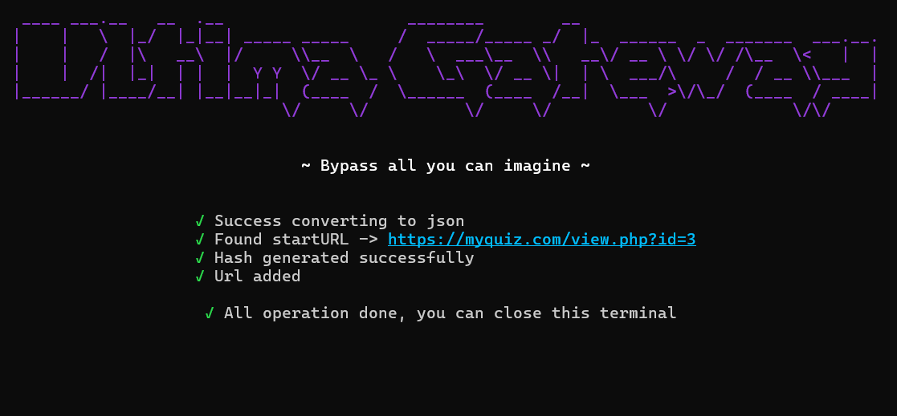

<div align="center">


**Ultima Gateway**
Bypass all you can imagine
</div>


## Usage

```bash
git clone https://github.com/seynth/ultima-gateway
cd ultima-gateway
go run .
```
Ketik seb config file path atau bisa dengan drag and drop ke terminal 





## Todo
- Error handling


## Reference
- [about config key hash](https://safeexambrowser.org/developer/seb-config-key.html)